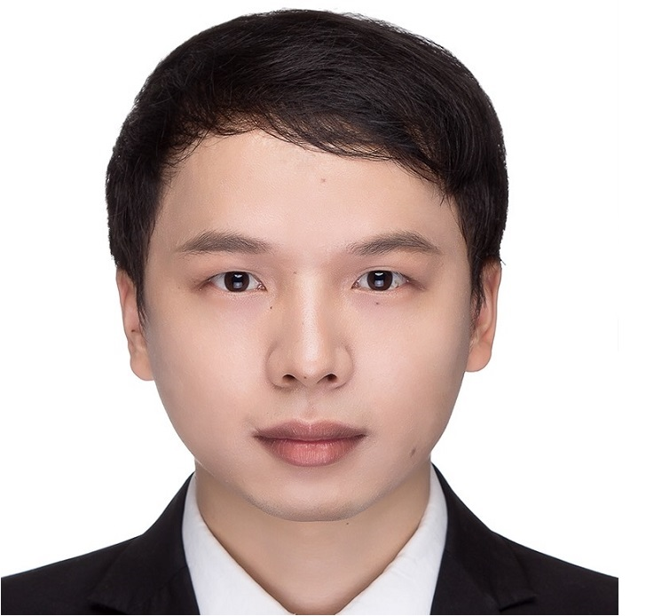

2013年大学本科毕业于厦门大学软件学院，并保送硕士研究生至厦门大学软件学院计算机科学与技术专业，于2015年3月通过硕博连读考核后攻读博士学位，研究方向主要集中于网格变形、人体三维重建和人机交互等。硕博期间，参与厦门大学信息学院移动与互联网研究与开发中心的多个项目（包括厦门市重大科技项目，教育部-中国移动基金项目和国家科技支撑计划等重大项目），参与过四个国家自然科学基金项目。近期在研的是利用柔性传感器对人体体型重建和运动跟踪分析方面的相关研究工作。

---

### 教育经历

* 2019.8 — 至今	    厦门大学信息学院             博士
* 2015.9 — 2019.8	厦门大学软件学院             博士（硕博连读）
* 2013.9 — 2015.7	厦门大学软件学院             硕士（保送研究生）
* 2009.9 — 2013.7	厦门大学软件学院             本科

---

### 发表论文

#### 2020

1. Hechuan Zhang, **Zhiyong Chen (Equal Contribution)**, Shihui Guo, Juncong Lin, Yating Shi, Xiangyang Liu, Yong Ma:Sensock: 3D Foot Reconstruction with Flexible Sensors. CHI 2020: 1-13 **(CCF A类会议 共一)**

#### 2016

1. **Zhiyong Chen**, Juncong Lin, Guangyu Zhang, Wei Yang, & Guohua Huang. (2016). A Multi-touch Interface For Natural and Seamless Image Composition. 2016 11th International Conference on Computer Science & Education (ICCSE). IEEE. **(EI会议)**

1. **Zhiyong Chen**, Xing Gao, Wei Yang, Guangyu Zhang, Juncong Lin, & Lisheng Xiang. (2016). A multi-touch based file navigation interface. 2016 11th International Conference on Computer Science & Education (ICCSE). IEEE. **(EI会议)**

1. Leyi Wei, Bowen Zhang, **Zhiyong Chen**, Xing Gao, & Minghong Liao. (2016). Exploring local discriminative information from evolutionary profiles for cytokine-receptor interaction prediction. Neurocomputing, S0925231216306154. **(中科院JCR三区, IF 2.160)**
                 

---

### 获奖情况

#### 2015 - 2020

获2017年度厦门大学建设银行奖学金

获2016年“创青春”中航工业全国大学生创业大赛第十届“挑战杯”大学生创业计划竞赛 金奖

获第二届中国“互联网+”大学生创新创业大赛 铜奖

获2016年“创青春”第九届“挑战杯”福建省大学生创业计划竞赛 金奖

获“建行杯”第二届福建省“互联网+”大学生创新创业大赛金奖

获“象屿杯”第二届“创青春”厦门大学学生创业大赛金奖

#### 2013 - 2015

获2014-2015年度厦门大学软件学院“优秀学生干部”

获2013-2014年度厦门大学校“三好学生”

获2013-2014年度厦门大学软件学院“先进个人”

#### 2009 - 2013

获2012-2013年度厦门大学校“三好学生”

获2012-2013年度厦门大学国家励志奖学金

获2011-2012年度厦门大学软件学院“先进个人”

---

### 校内任职

2013.09—2015.7	厦门大学软件学院2013级研究生班 班长

---

### 学习经历

2018.11.17—2018.11.18	中国图像图形学学会   CSIG图像图形学科前沿讲习班

2014.07.21—2014.07.25	中国科技大学               计算机图形学前沿进展（USTC Summer School 2014 ）

